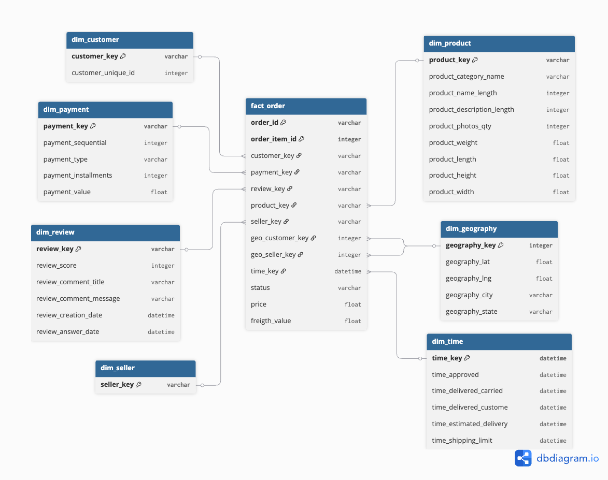
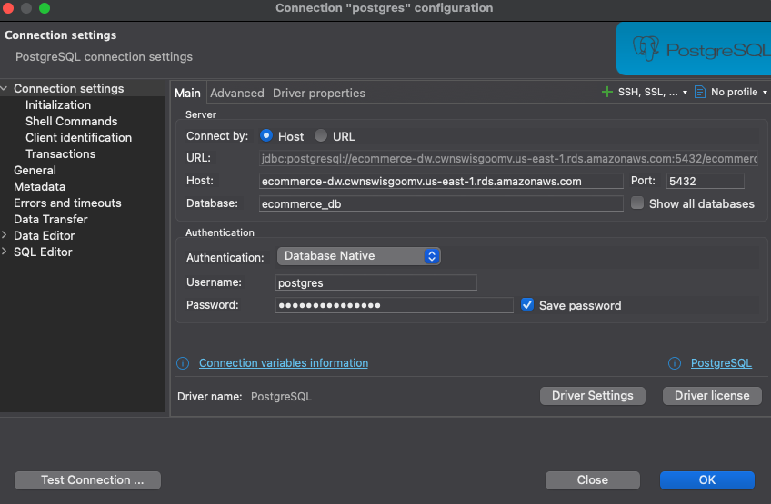
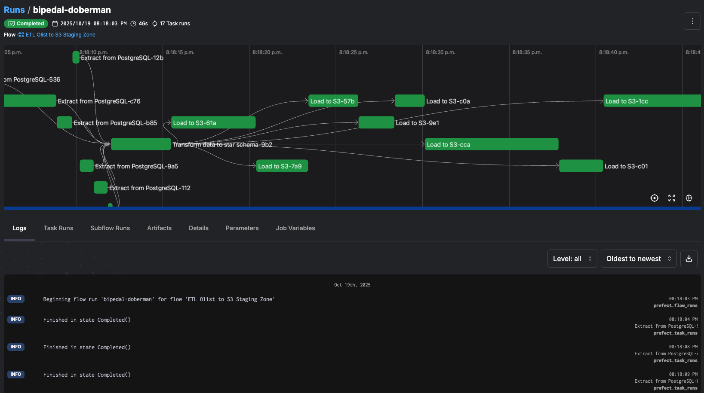
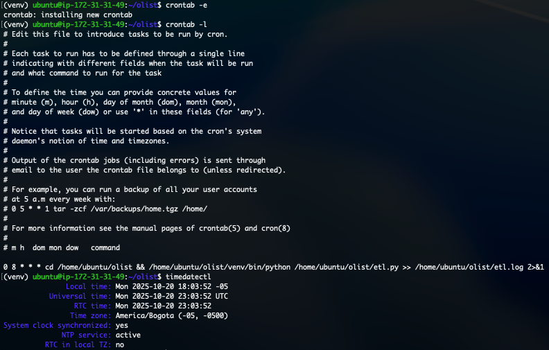
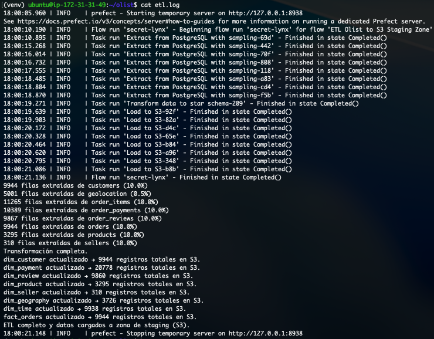
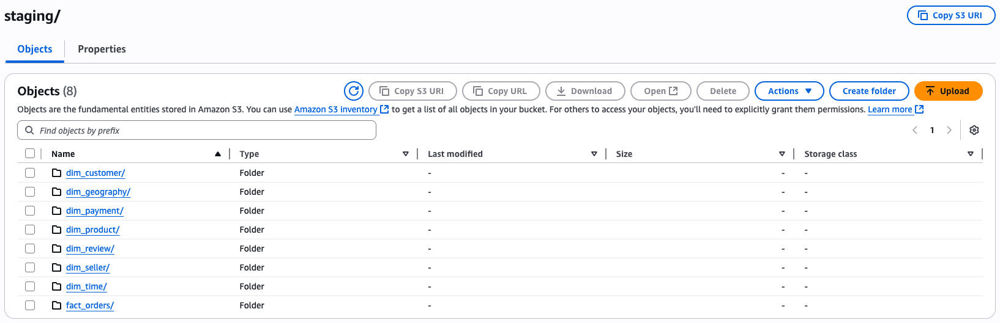
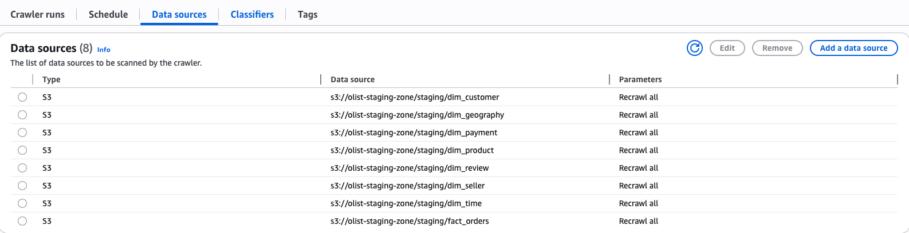
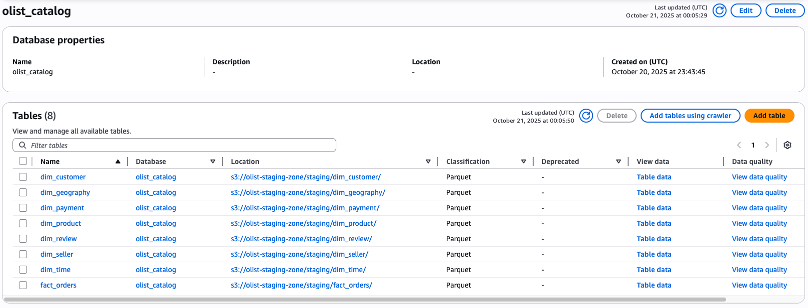

# Olist Data Pipeline – ETL + Data Warehouse + BI

## Descripción General
Este proyecto implementa un **pipeline completo de datos** para el dataset de **Olist**, utilizando servicios de **AWS** y un flujo **ETL automatizado**.  
El objetivo es **extraer**, **transformar** y **cargar (ETL)** los datos desde una base PostgreSQL hacia una **zona de staging en S3**, luego integrarlos con **Redshift Serverless** mediante **Glue Data Catalog**, y finalmente conectar el **Data Warehouse** con una herramienta de visualización.

## Arquitectura General

**Flujo del pipeline:**
1. **PostgreSQL (RDS)** →  
2. **EC2 (Python + Prefect)** →  
3. **S3 (Staging Parquet Zone)** →  
4. **AWS Glue (Crawler + Data Catalog)** →  
5. **Redshift Serverless (Data Mart / Spectrum)** →  
6. **Herramienta BI (QuickSight / Power BI / Tableau)**

## Componentes Implementados

### 1. **Creación DataMart - Insercción Datos a RDS**

**Se creó un DataMart a partir de las tablas exitentes dentro de `olist.sql`**


**Se desarrolló la creación de las tablas dentro del RDS y la carga utilizando `EL.py`**


### 2. **ETL Automatizado con Prefect y EC2**

- **Script principal:** `ETL.py`
- **Orquestador:** Prefect 3.0 (modo local)
- **Ejecución automática:** Configurada con `crontab` para correr todos los días a las 8 AM.
- **Carga incremental:** Los datos se agregan (`append`) en S3 sin sobrescribir los existentes.

#### Flujo general de Prefect
El flujo orquesta las siguientes tareas:
1. Extracción de datos desde PostgreSQL.
2. Transformaciones intermedias y construcción de modelo estrella.
3. Carga de datos en S3 (zona de staging).
4. Actualización incremental con deduplicación según llave primaria.




### 3. **Configuración del entorno EC2**

El servidor EC2 ejecuta el flujo ETL automáticamente utilizando **crontab**.

**Configuración del cronjob**
```bash
0 8 * * * cd /home/ubuntu/olist && /home/ubuntu/olist/venv/bin/python /home/ubuntu/olist/etl.py >> /home/ubuntu/olist/etl.log 2>&1
```
> Ejecuta el flujo todos los días a las 8:00 a.m.

> Guarda los logs en etl.log

> Utiliza entorno virtual Python (venv)





### 4. **Zona de Stagging (Amazon S3)**

Los datos transformados se almacenan en formato Parquet, organizados por carpetas según las tablas del modelo estrella.

```bash
s3://olist-staging-zone/staging/
│
├── dim_customer/
├── dim_geography/
├── dim_payment/
├── dim_product/
├── dim_review/
├── dim_seller/
├── dim_time/
└── fact_orders/
```



### 5. **AWS Glue - Crawler y Data Catalog**

- **Crawler:** escanea los archivos Parquet en S3.
- **Data Catalog:** registra el esquema de cada tabla del modelo estrella.
- **Base:** olist_catalog




### 6. **Amazon Redshift Serverless - Data Mart**

- **Namespace:** olist-dwh
- **Workgroup:** default-workgroup
- **Conexión:** asociada con IAM Role con permisos de acceso a S3 y Glue.
- **Acceso externo:** Redshift Spectrum consulta directamente los parquet desde S3.


## Variables de Entorno
PG_USER=postgres
PG_PASS=******
PG_HOST=<endpoint-RDS>
PG_PORT=5432
PG_DB=olist_db

S3_BUCKET=olist-staging-zone
AWS_ACCESS_KEY_ID=******
AWS_SECRET_ACCESS_KEY=******
AWS_REGION=us-east-1
